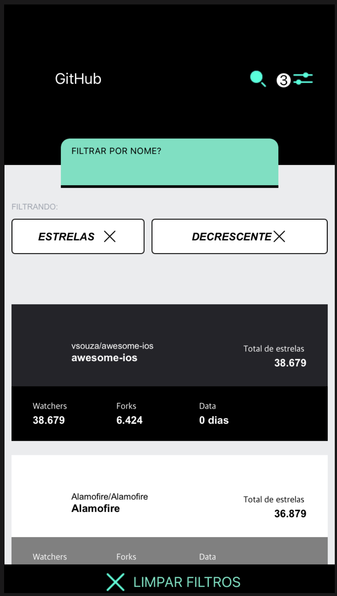
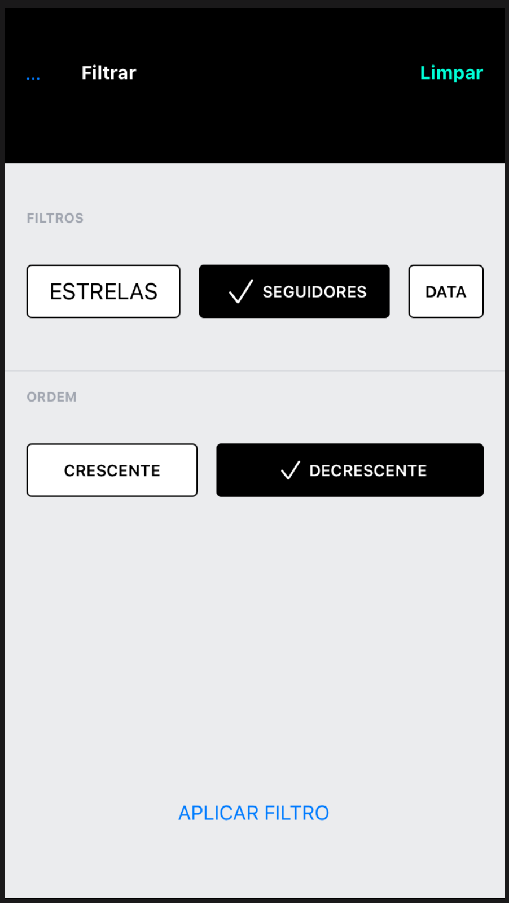

# Desafio Modal

O app consome a [API do GitHub](https://developer.github.com/v3) e lista os principais repositórios e os filtra de acordo com suas classificações de `estrelas`, `seguidores` ou `data do ultimo commit` além de organiza-los do menor para o maior ou do maior para o menor [`Crescente`, `Decrescente`]

Outra funcionalidades incluem:
- Mostrar ícone e informações básicas do repo.
- Paginação com rolagem infinita.
- Puxe para atualizar a lista de pedidos.
- Segue anexo arquivo [Github Teste.fig](Docs/Github_Teste.fig) com o layout.

## Como testar:

Para executar o projeto basta clonar este repositório e compilar o projeto com o `XCode`

## Prerequisites

Tudo o que você precisa para rodar o app.

1. `Xcode 13.1+`
2. `iOS 13.0+`
3. `Swift 5+`
4. `Swiftlint`
5. `RxSwift`

# ScreenShots

# Autores

